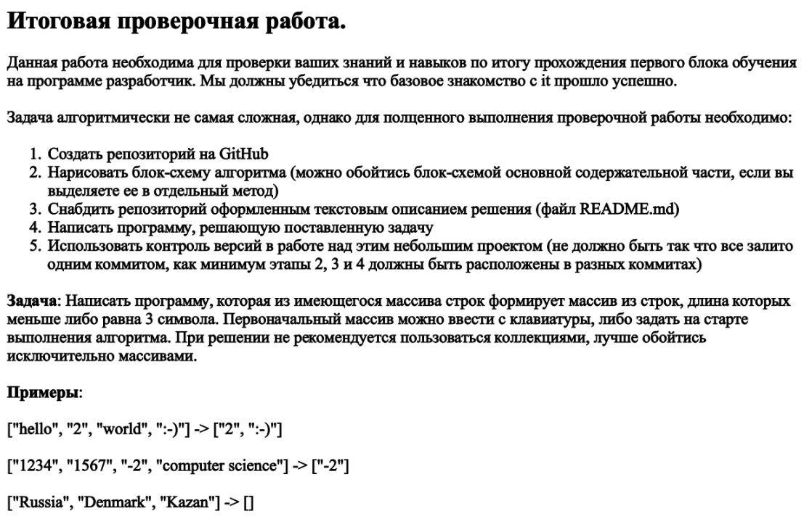

# KR1-GB
# Задание

# Принцип работы программы
1. Задаётся массив состоящий из 4 строк.
2. Работает первая функция, которая выводит первоначальный массив (*массив void ReadArray()*)/
3. Работет вторая функция, которая выводит новый массив из строк, состощих не более чем 3х символов (*массив void PrintArray()*).
